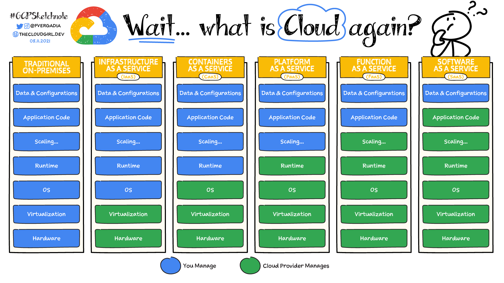

## Actividad 03

Computación en la nube

### Parte 1

#### A. Cuestionario

1. **Motivaciones para la nube**  
   
   - **(a)** ¿Qué problemas o limitaciones existían antes del surgimiento de la computación en la nube y cómo los solucionó la centralización de servidores en data centers?

        Problemas y limitaciones: 
        
        - Dependencias de hardware, servidores, almacenamiento y otros equipos.
        - Costos, ya que para toda la infraestructura requerían una gran inversión, ademas, para el mantenimiento y manipulación de estos, también requerían personal calificado.
        - Espacio físico, para tener toda esta infraestructura, se requería un ambiente adecuado.

        La centralización de servidores en data centers, da una solución a los problemas debido a que las empresas ya no tenían que preocuparse por todo el manejo de la infraestructura, estos ya quedaban en manos de los empresas de data centers que se encargan de todo el mantenimiento, manipulación, configuración, etc.

   - **(b)** ¿Por qué se habla de “The Power Wall” y cómo influyó la aparición de procesadores multi-core en la evolución hacia la nube?

        Se refiere a las limitantes de procesadores en aquel entonces, ya que no podían seguir aumentando su velocidad de procesamiento, en estos tiempos para aumentar el rendimiento de los procesadores, aumentaban la frecuencia esto hacia que los procesadores se calentaran mas, y para enfriarlos se necesitaba mas energía, ademas de que había los chips se dañen. 

        Para solucionar todo esto surge los procesadores multi-core, que son mas rápidos, y mejoran la eficiencia energética. Este tipo de procesadores facilitaron el procesamiento en paralelo lo cual es fundamental para la infraestructura de la nube.

2. **Clusters y load balancing**  
   
   - **(a)** Explica cómo la necesidad de atender grandes volúmenes de tráfico en sitios web condujo a la adopción de clústeres y balanceadores de carga.  

      A medida que los sitios web comenzaron a recibir grandes volúmenes de tráfico y a enfrentar picos de usuarios en ciertos momentos, un solo servidor ya no era suficiente para manejar todas las solicitudes de manera rápida y estable.

      Para manejar estos casos, se utilizan clusters y balanceadores de carga, que distribuyen el trabajo entre varios recursos, mejorando el rendimiento, brindando lata disponibilidad, tolerancia a fallos, entre otros, ademas facilitando la escalabilidad. 
   
   - **(b)** Describe un ejemplo práctico de cómo un desarrollador de software puede beneficiarse del uso de load balancers para una aplicación web.

      Un desarrollador de software creo una aplicación web para ventas online, la cual empieza a popularizarse, por lo cual comienza a tener muchas visitas. 

      Esta alta demanda ara que el servidor empiece a ponerse lento o incluso llegar a caerse por el alto trafico, aquí entra *load balance*, este se encarga de distribuir el trafico entre los servidores disponibles, esto da un mejor rendimiento y evita que la aplicación se caiga, si en caso sucede redirige el trafico a uno disponible, y de esta manera se puede escalar agregando mas servidores si en caso se necesite.

3. **Elastic computing**  
   
   - (a) Define con tus propias palabras el concepto de Elastic Computing.

      Elastic Computing es la capacidad de un sistema para ajustar dinámicamente sus recursos (como memoria y almacenamiento), esto según la demanda que tenga, esto se hace encendiendo o apagando nodos según sea necesario para manejar cargas variables.
   
   - **(b)** ¿Por qué la virtualización es una pieza clave para la elasticidad en la nube?

      La virtualización es clave para la elasticidad en la nube, ya que permite crear múltiples máquinas virtuales en un solo servidor físico, optimizando los recursos, ademas de que garantiza aislamiento y seguridad, y reduciendo costos al necesitar menos hardware.
   
   - (c) Menciona un escenario donde, desde la perspectiva de desarrollo, sería muy difícil escalar la infraestructura sin un entorno elástico.

      Mencionando el ejemplo mencionado anteriormente, la aplicación web para ventas online, al aumentar las visitas, sin un entorno elástico, para evitar que la aplicación se caiga, tendría que migrar a un servidor con mas capacidad, la que necesita configurarse nuevamente, ya al aumentar el trafico nuevamente, repetiríamos la acción, asta un momento donde ya no se pueda realizar. Esto limita la escalabilidad del software.

4. **Modelos de servicio (IaaS, PaaS, SaaS, DaaS)**  
   
   - **(a)** Diferencia cada uno de estos modelos. ¿En qué casos un desarrollador optaría por PaaS en lugar de IaaS? 

      - **IaaS** (Infraestructura como Servicio): Proporciona recursos de infraestructura como servidores, redes, almacenamiento y máquinas virtuales; ejm: AWS, Microsoft Azure VM
      - **PaaS** (Plataforma como Servicio): Ofrece un entorno completo para desarrollar, probar y desplegar aplicaciones. No te preocupas por la infraestructura: está todo gestionado; ejm: Heroku, DigitalOcean, Render.
      - **SaaS** (Software como Servicio): Aplicaciones listas para usarse a través de internet. No necesitas instalar nada ni preocuparte por actualizaciones. ejm: WordPress, Google Docs
      - **DaaS** (Escritorio como Servicio): Permite acceder a un escritorio virtual (como una computadora completa) desde cualquier lugar, a través de internet. ejm: Data(DaaS) de Oracle

      Según lo anterior, un desarrollador optaría por un PaaS, cuando necesite centrarse en mejorar la calidad del producto y no quiera encargarse del manejo de la infraestructura, ya que no necesita dedicarse a la configuraciones de servidores, eficiencia en infraestructura, etc.
   
   - **(b)** Enumera tres ejemplos concretos de proveedores o herramientas que correspondan a cada tipo de servicio.

      - **IaaS**: AWS EC2, Microsoft Azure VM, Google Compute Engine:
      - **PaaS**: Heroku, DigitalOcean, Render.
      - **SaaS**: WordPress, Google Docs, Classroom
      - **DaaS**: Data(DaaS) de Oracle (servicio que ofrece acceso a datos de empresas y contactos para marketing, ventas y otros), Citrix Managed Desktops (proveedor de escritorios remotos para MS-DOS y Windows).

5. **Tipos de nubes (Pública, Privada, Híbrida, Multi-Cloud)**  
   
   - **(a)** ¿Cuáles son las ventajas de implementar una nube privada para una organización grande?  

      Las nubes privadas ofrecen un control total, cumplimiento regulaciones estrictos, te permite una mayor personalización para cargas específicas, costos predecibles, seguridad y configuraciones dedicadas, ademas de control sobre la ubicación física de los datos para cumplir con normativas de soberanía.

   - **(b)** ¿Por qué una empresa podría verse afectada por el “provider lock-in”?

      Una empresa puede verse afectada por el "provider lock-in" cuando sus aplicaciones y datos dependen de servicios exclusivos de un proveedor cloud, la falta de equivalentes directos en otras plataformas o la dificultad de migrar este servicio a uno propio, dificulta la salida del proveedor. Además, las aplicaciones suelen aprovechar características específicas del proveedor, ya que estos dependen de la plataforma con software, aplicaciones, hardware o equipos propietarios del proveedor.

      Un ejemplo de esto serian las tarjetas SIM entre los distintos proveedores de servicio telefónicos(en años anteriores), donde al querer cambiar de operador, no podías utilizar el SIM al pasar a otro proveedor, por ello perdías tu numero telefónico, ocasionando problema a personas que tienen una red de contactos importantes para los negocios, esto ya no es asi en la actualidad, debido a la portabilidad.
   
   - **(c)** ¿Qué rol juegan los “hyperscalers” en el ecosistema de la nube?

      Los hyperscalers ofrecen servicios de cloud computing y de gestión de datos para las empresas que requieren una amplia infraestructura para el procesamiento y el almacenamiento de datos a gran escala. 

      Los hyperscalers (AWS, Microsoft Azure, Google Cloud) impulsan la innovación tecnológica en la nube, estableciendo estándares y ofreciendo infraestructura global masiva que garantiza fiabilidad, rendimiento, escalabilidad y alto disponibilidad; ademas de facilitar el desarrollo de aplicaciones globales.

#### B. Actividades de investigación y aplicación

1. **Estudio de casos**  
   
    **Netflix** ([ref](https://about.netflix.com/es/news/completing-the-netflix-cloud-migration))

    - Motivaciones para la migración: 
      
        Escalabilidad y disponibilidad, se necesitaba una infraestructura que pudiera adaptarse al crecimiento rápido de sus usuarios y manejar picos de demanda sin interrupciones para garantizar una buena experiencia al usuario.​
    - Beneficios obtenidos:

        *Reducción de costos*: Al migrar a la nube, Netflix eliminó la necesidad de mantener centros de datos físicos, reduciendo significativamente los gastos operativos.​
        
        *Escalabilidad*: La nube permitió ajustar rápidamente sus recursos según la demanda, garantizando un servicio ininterrumpido durante picos de tráfico.​

        *Alta disponibilidad*: Uso de múltiples regiones en la nube para evitar caídas del servicio y dar una mejor experiencia a sus usuarios.
    - Desafíos enfrentados:
        
        *Seguridad y privacidad de datos*: La migración a la nube requirió implementar medidas robustas para proteger la información sensible de los usuarios y cumplir con regulaciones de privacidad por regiones.​

        *Migración de datos*: Migración de volúmenes enormes de datos sin interrumpir el servicio a los usuarios.

    **Spotify** ([ref](https://www.cio.com/article/2069835/como-spotify-migro-a-google-cloud-platform.html))

    - Motivaciones para la migración: 
      
        - Crecimiento de usuarios y contenido multimedia(audio)
        - Limitaciones en infraestructura
        - Expansión a nivel mundial

    - Beneficios obtenidos:

        - La nube facilitó la implementación de nuevas características y actualizaciones sin afectar el servicio existente.​
        - La infraestructura en la nube permitió procesar datos de manera más eficiente.
        - Mejorando la experiencia del usuario con recomendaciones más precisas.​

    - Desafíos enfrentados:
        
        - Adaptar sus sistemas existentes a la nueva infraestructura.
        - Gestión de transferencia de enormes bibliotecas de música
        - Adaptación a diferentes legislaciones de privacidad por región.

2. **Comparativa de modelos de servicio**  
   
   - Realiza un cuadro comparativo en el que muestres las **responsabilidades** del desarrollador, del proveedor y del equipo de operaciones en los distintos modelos (IaaS, PaaS, SaaS).
   
      Mostramos un cuadro comparativo de responsabilidades ([ref](https://cloud.google.com/learn/paas-vs-iaas-vs-saas?hl=es))

      

3. **Armar una estrategia multi-cloud o híbrida**  
   
   - Imagina que trabajas en una empresa mediana que tiene una parte de su infraestructura en un data center propio y otra parte en un proveedor de nube pública.  
   
   - Diseña una estrategia (de forma teórica) para migrar el 50% de tus cargas de trabajo a un segundo proveedor de nube, con el fin de no depender exclusivamente de uno.  
   
   - Explica dónde iría la base de datos, cómo manejarías la configuración de red y cuál sería el plan de contingencia si un proveedor falla.

4. **Debate sobre costos**  
   - Prepara un breve análisis de los pros y contras de cada tipo de nube (pública, privada, híbrida, multi-cloud) considerando:
     1. Costos iniciales (CAPEX vs. OPEX).  
     2. Flexibilidad y escalabilidad a mediano y largo plazo.  
     3. Cumplimiento con normativas (p.ej. GDPR, HIPAA).  
     4. Barreras o complejidades al cambiar de proveedor.
