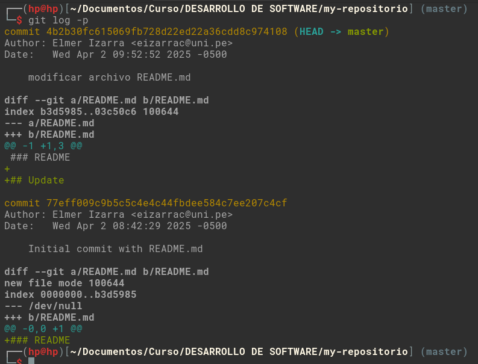

## Actividad 4

Explorando Git

### Git

1. Configuramos git con el comando `git config`

    ```bash
    git config --global user.name "Elmer Izarra"
    git config --global user.email "eizarrac@uni.pe"
    git config --global user.username "izarra-ch"
    ```

2. Mostramos la configuración hecha con el comando `git config --list`

    

3. Creamos un nuevo repositorio en git, de manera local con el comando `git init`, esto se puede realizar de dos maneras:

    ```
    // crear una carpeta, moverse al directorio e iniciar git
    mkdir my-repositorio && cd my-repositorio && git init

    // crear el repositorio directamente
    git init my-repositorio
    ```

    

4. Agregamos nuestro primer archivo al repositorio, podemos realizarlo utilizando un editor de texto o utilizar la consola para ello, en este caso lo realizamos por consola utilizando `nano`.

    ```bash
    nano README.md
    ```

    

5. Como README.md es un nuevo archivo para git, utilizamos `git state` para visualizar, como lo reconoce.

    

6. Para el archivo aun no esta rastreado por git, utilizamos el comando `git add` para que el archivo este en un estado rastreado para git.

    

7. Como el archivo ya esta preparado(stage), necesitamos registrar estos cambios (confirmar cambios), para esto utilizamos el comando `git commit -m "message"`, al ejecutar el comando, los cambios ya están confirmado, y al utilizar `git status`, ya no tendremos cambios a rastrear, y si queremos her el commit registrado, utilizamos el comando `git log`, esto nos muestra el historial de commits realizados.

    

8. `git log` puede combinarse con opciones donde te permite formatear la salida, aquí algunos ejemplos.

    - `git log -p`: muestra los cambios introducidos en los commit

      

    - `git log --graph`: Muestra historial de ramas y merges , para visualizar esto, primero creamos una rama, y en la nueva rama agregamos un nuevo archivo, para luego realizamos el merge.

      ```bash
      git branch rama1
      git checkout rama1
      nano archivo-rama1.txt
      git status
      git add archivo-rama1.txt
      git commit -m "agregando archivo-rama1.txt"
      ```

      Una vez que tengamos los comits y el merge realizados, vemos el resultado del comando `git log --graph`.

      
     
