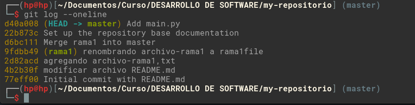
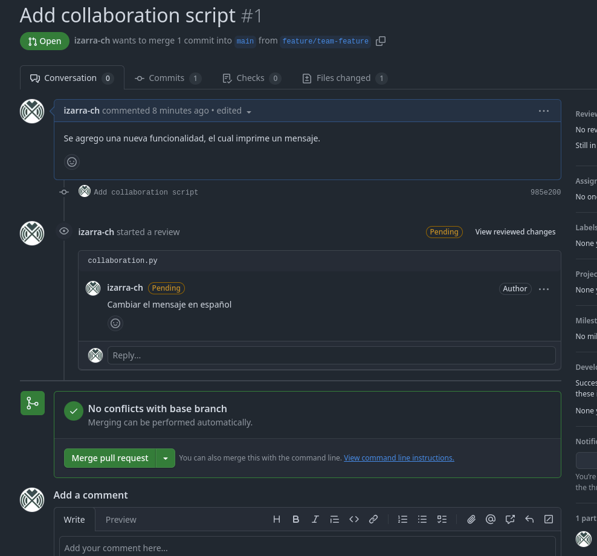
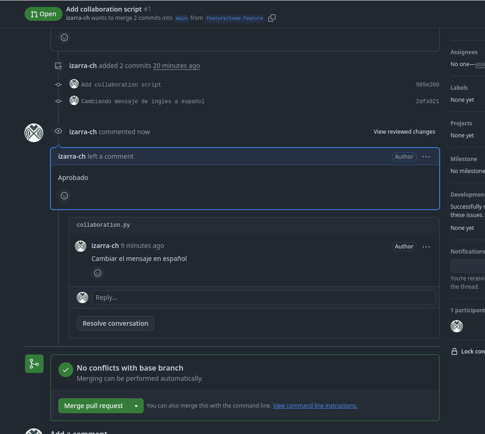
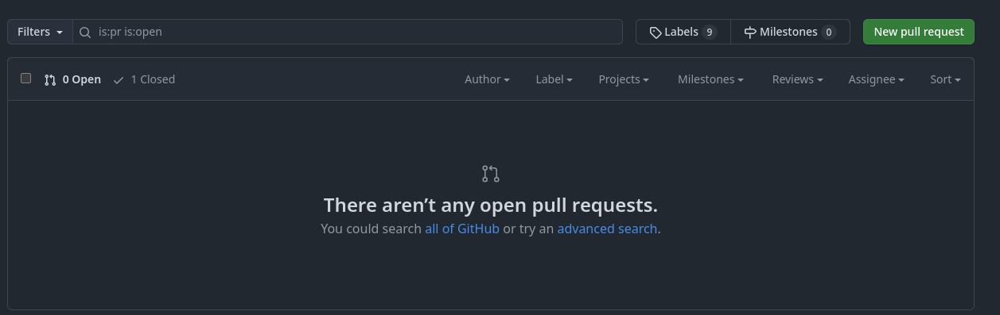

## Actividad 4

Explorando Git

### git config: Preséntate a Git

1. Configuramos git con el comando `git config`

    ```bash
    git config --global user.name "Elmer Izarra"
    git config --global user.email "eizarrac@uni.pe"
    git config --global user.username "izarra-ch"
    ```

2. Mostramos la configuración hecha con el comando `git config --list`

    

### git init: Donde comienza tu viaje de código

1. Creamos un nuevo repositorio en git, de manera local con el comando `git init`, esto se puede realizar de dos maneras:

    ```
    // crear una carpeta, moverse al directorio e iniciar git
    mkdir my-repositorio && cd my-repositorio && git init

    // crear el repositorio directamente
    git init my-repositorio
    ```

    

### git add: Preparando tu código

1. Agregamos nuestro primer archivo al repositorio, podemos realizarlo utilizando un editor de texto o utilizar la consola para ello, en este caso lo realizamos por consola utilizando `nano`.

    ```bash
    nano README.md
    ```

    

2. Como README.md es un nuevo archivo para git, utilizamos `git state` para visualizar, como lo reconoce.

    

3. Para el archivo aun no esta rastreado por git, utilizamos el comando `git add` para que el archivo este en un estado rastreado para git.

    

### git commit: registra cambios

1. Como el archivo ya esta preparado(stage), necesitamos registrar estos cambios (confirmar cambios), para esto utilizamos el comando `git commit -m "message"`, al ejecutar el comando, los cambios ya están confirmado, y al utilizar `git status`, ya no tendremos cambios a rastrear, y si queremos her el commit registrado, utilizamos el comando `git log`, esto nos muestra el historial de commits realizados.

    

### git log: Recorrer el árbol de commits

1. `git log` puede combinarse con opciones donde te permite formatear la salida, aquí algunos ejemplos.

    - `git log -p`: muestra los cambios introducidos en los commit

      

    - `git log --graph`: Muestra historial de ramas y merges , para visualizar esto, primero creamos una rama, y en la nueva rama agregamos un nuevo archivo, para luego realizamos el merge.

      ```bash
      git branch rama1
      git checkout rama1
      nano archivo-rama1.txt
      git status
      git add archivo-rama1.txt
      git commit -m "agregando archivo-rama1.txt"
      ```

      Una vez que tengamos los comits y el merge realizados, vemos el resultado del comando `git log --graph`.

      

2. ¿Cual es la salida de este comando?

    > git log --graph --pretty=format:'%x09 %h %ar ("%an") %s'


    El comando anterior lo que hace es mostrar el historial de commit del repositorio, en formato de gráfico ASCII, personalizando la salida de los commit de la siguiente forma, muestra el hash corto del commit, agrega el tiempo transcurrido desde el commit, agrega el usuario que realizo el commit y agrega el mensaje del commit, agregando un tabulador entre los elementos mencionados.

    

3. Intentemos el comando git log en este ejercicio (puedes realizar otra cosa como colocar las cosas en español). Primero, actualiza el archivo README.md y crea un nuevo archivo CONTRIBUTING.md

    Antes de realizar los cambios y el commit, mostramos el ultimo log en los registros.

    

    Realizamos los cambios solicitados y ejecutamos en comando `git log --oneline`, nos muestra el historial de comits.

    

### Trabajar con ramas: La piedra angular de la colaboración

1. `git branch`, lista las ramas que hay en nuestro repositorio, resaltando la rama en la actual en la que se esta trabajando.

    

2. `git branch nombre_rama`, nos permite crear una nueva rama, a partir de la rama actual.

    

3. También podemos crear una nueva rama a partir de una rama en especifico, sin necesidad de estar en dicha rama, esto lo hacemos con `git branch new_rama base_rama` o también desde un commit en especifico `git branch <new-branch-name> <commit-hash>`

4. Crear una rama desde un commit específico

    Mostramos los últimos 4 commit de la rama master, y creamos una nueva rama, a partir del commit con hash `22b873c9616d9390bf675e99f2a3cb574cde31cd`

    

    Al crear la rama3, y posicionarnos en ella, mostramos los commit que contiene y nos percatamos que la rama 3 no contiene los commit con mensajes *Add main.py* y *actualizando main.py*, ya que lo creamos desde el commit con mensaje *Set up the repository base documentation*.

    

    otra manera de crear la rama a partir de un commit es de la siguiente manera:

    ```bash
    // Verifica el historial de commits para identificar el commit específico
    $ git log --oneline

    // Crear una nueva rama 'hotfix/bugfix' basada en el commit 'abc1234'
    $ git branch hotfix/bugfix abc1234

    // Cambia a la nueva rama 'hotfix/bugfix'
    $ git checkout hotfix/bugfix
    ```
  
### git checkout/git switch: Cambiar entre ramas

1. Para cambiar entre ramas lo realizamos con el comando `git checkout nombre_rama`.

    


### Preguntas.

1. ¿Cómo te ha ayudado Git a mantener un historial claro y organizado de tus cambios?

    Git permite mantener un historial claro y organizado de los cambios registrados con mensajes descriptivos, usar ramas para trabajar de manera aislada en nuevas funcionalidades y fusionarlas de forma segura. Esto facilita la trazabilidad de los cambios registrados a lo largo del historial registrado.

2. ¿Qué beneficios ves en el uso de ramas para desarrollar nuevas características o corregir errores?

    * Separación del código principal al momento de trabajar en nuevas funcionalidades o correcciones, con lo cual no afectas el código.
    * Seguimiento de funcionalidades, ya que una rama contiene la nueva funcionalidad que se tiene.
    * colaborar efectivamente con otros desarrolladores, ya que cada uno trabaja en distintas ramas de manera simultanea sin interferir entre ellos.

3. Realiza una revisión final del historial de commits para asegurarte de que todos los cambios se han registrado correctamente.

    Aquí mostramos los distintos commits y que se realizaron en la rama master.

    

### EJERCICIO 1:

  Manejo avanzado de ramas y resolución de conflictos

  Generación de la rama y modificaciones para generar el conflicto.

  

  Merge con conflicto.

  

  

  Solucionamos conflicto manualmente

  

### EJERCICIO 2: 

Exploración y manipulación del historial de commits

- Usamos el comando `git log -p ` para explorar el historial de commits, pero esta vez con más detalle:

    

- Usamos el siguiente comando para mostrar solo los commits realizados por un autor específico, `git log --author="Elmer Izarra"`:

    

- Revertir un commit: utilizamos para revertir el commit mas reciente.

    

    verificamos que los el archivo main.py no tenga el cambio que ingreso en el commit que se tubo que revertir.

    

- Visualización gráfica del historial:

    

### EJERCICIO 3: 

Creación y gestión de ramas desde commits específicos

- Creamos una rama a partir de un commit en especifico y hacemos una corrección en el archivo main.py

    

- Ahora fusionamos dicha rama en la ram principal, y al mostrar los commit, vemos que los cambios realizados se agregan al inicio del historial, pero manteniendo los commit que ya se registraron.

    

### EJERCICIO 4: 

Manipulación y restauración de commits con git reset y git restore

- Hacer cambios en el archivo main.py, para agregarlo con un commit y luego realizar el reset, el cual quitara el commit mas resiente.

    

- Ahora veremos como se utiliza el `git restore` el cual se utiliza antes de confirmar los cambios hechos, para deshacer dichos cambios.

    

### Ejercicio 5: 

Trabajo colaborativo y manejo de Pull Requests

- Creamos un repositorio en github para trabajar sobre ello.

    

- Clonamos el repositorio para trabajar sobre ella, generando una nueva rama para agregar nuevas características y subir dichos cambios al repositorio remoto.

    

    

- Verificamos que la rama se haya subido para generar el pull requests y fusionarlo.

    Verificamos que se subió la rama
    
    

    Generamos el pull requests

    

    

    

    Revisamos los cambios que se mandaron.
    
    

    Agregando un comentario para corregir el código.

    

    

    Enviamos el commit con la corrección según los comentario y revisamos los cambios.

    

    Confirmamos los cambios.

    

    

    Fusionamos la rama.

    

    

    Verificamos que ya se aprobó el PR y que ya se fusiono.
    
    

    

    Hacemos la verificación con git, realizando un pull para traer los cambios de la rama remota y ver los logs.

    

### EJERCICIO 6: 

Cherry-Picking y Git Stash

- Cherry-Picking, nos permite llevar los cambios de un commit a otra rama que no tenga dichos cambios, para esto realizamos cambios en main.py y confirmarlos dichos cambios, luego creamos una rama a partir de un commit anterior, para no tener los cambios realizados en el la nueva rama, para finalmente llevar dichos cambios utilizando `cherry-pick`

    

    

    

- `git stash`, es algo parecido a cherry-pick, pero se utiliza en cambios no confirmados, podemos guardar los cambios de manera temporal con el comando `git stash`, y luego aplicar estos cambios, en la misma rama u otros con el comando `git stash pop`.

    

