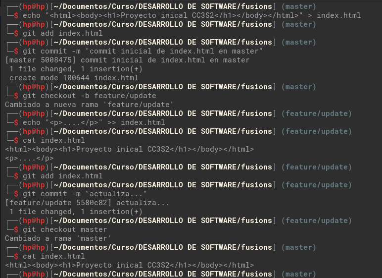
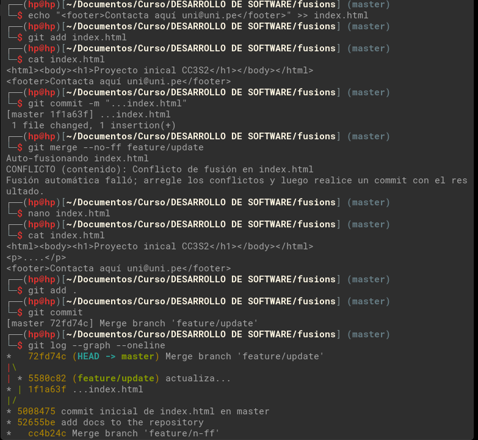
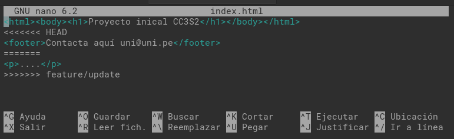
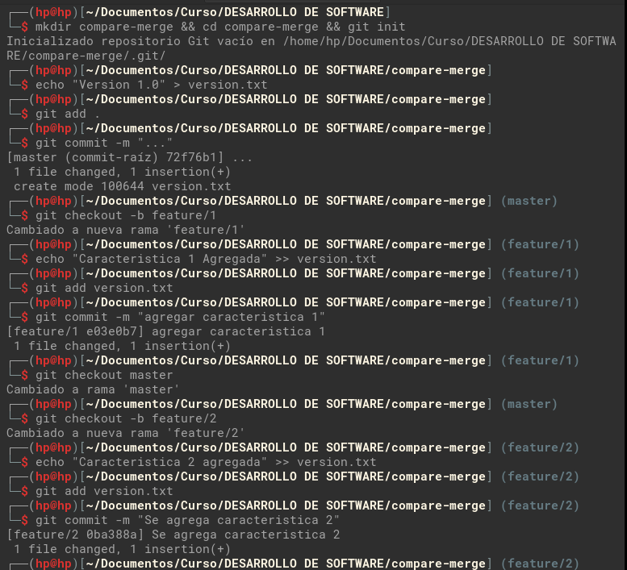
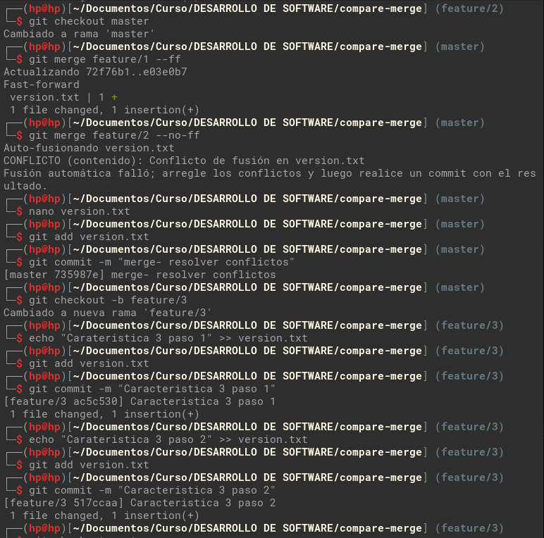
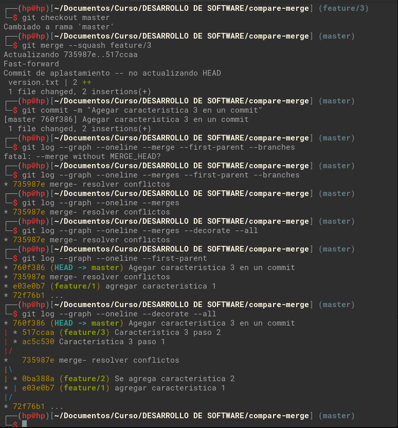
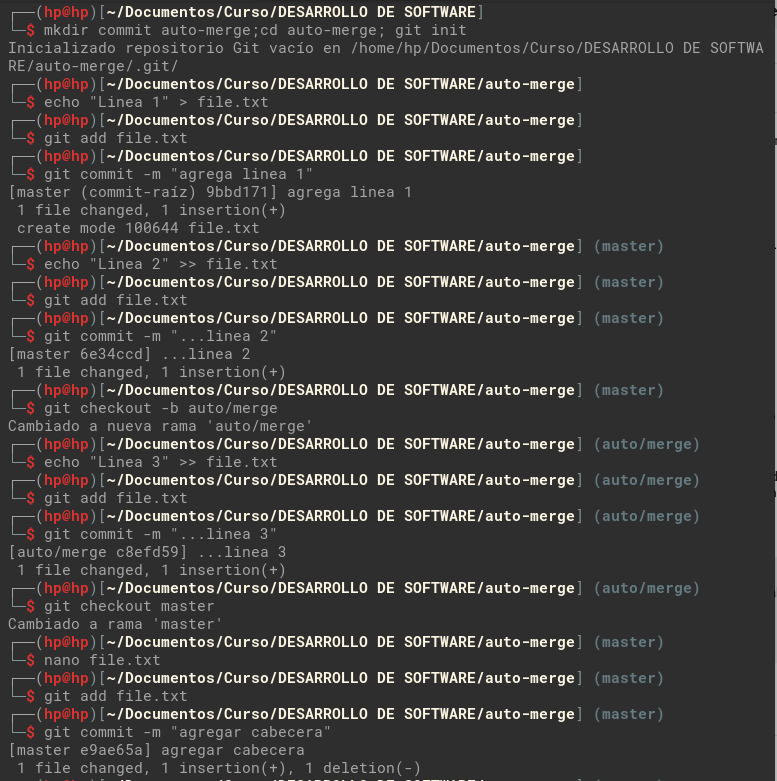
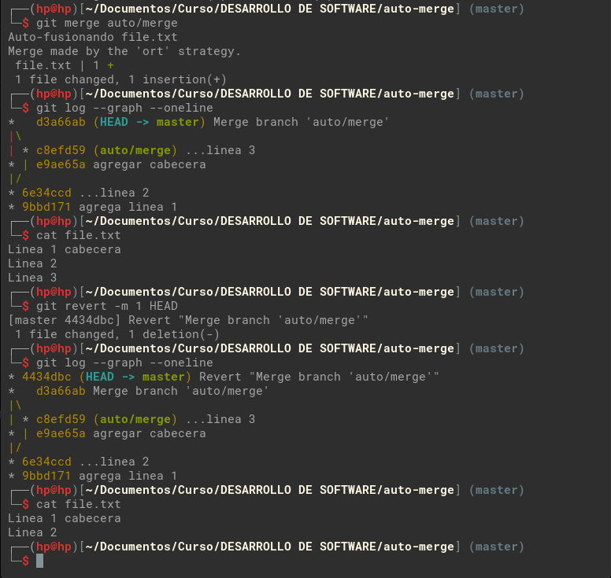

## Fusiones en Git

### 1. Fusión Fast-forward (git merge --ff)

```bash
# Creamos un directorio de trabajo y nos posicionamos en el directorio
mkdir fusions && cd fusions

# inicializamos Git
git init

# Agregamos el archivo README.md
echo "# mi Proyecto" > README.md

# Confirmamos los cambios
git add README.md
git commit -m "add readme file to master"

# Generamos una rama de trabajo a partir de master
git checkout -b add-description

# Realizamos cambios en README.md
echo "Este es un proyecto de ejemplo para usar git" >> README.md

# Confirmamos los cambios
git add README.md
git commit -m "add description to readme"

# Regresamos a la rama master
git checkout master

# Realizamos la fusión (por defecto es --ff)
git merge add-description

# Mostramos el historia de commits
git log --graph --oneline

# No se crea commit adicional de fusión.
```


### 2. Fusión No-fast-forward (git merge --no-ff)

```bash
# Generamos rama para --no-ff a partir de master
git checkout -b feature/n-ff

# agregamos cambios en README.md
echo "Nueva característica para n-ff" >> README.md

# Confirmamos los cambios
git add README.md
git commit -m "add next description(n-ff)" 

# Regresamos a la rama master
git checkout master

# Realizamos la fusión --no-ff
git merge --no-ff feature/n-ff

# Mostramos el historia de commits y ver diferencia
git log --graph --oneline

# Se crea un nuevo commit, commit de fusión.
```


### 3. Fusión squash (git merge --squash)

```bash
# Generamos rama para squash a partir de master
git checkout -b feature/squash

# Creamos nuevo archivo CONTRIBUTING.md
echo "# Como contribuir" > CONTRIBUTING.md

# Confirmamos los cambios
git add CONTRIBUTING.md
git commit -m "add CONTRIBUTING.md" 

# Creamos nuevo archivo LICENSE.txt
echo "# Licencia" >> LICENSE.txt

# Confirmamos los cambios
git add LICENSE.txt
git commit -m "add LICENSE.txt" 

# Regresamos a la rama master
git checkout master

# Realizamos la fusión --squash
git merge --squash feature/squash

# Mostramos el historia de commits y ver diferencia
git log --graph --oneline

# Confirmamos el squash
git add .
git commit -m "add docs to the repository"

# Volvemos a mostramos el historia de commits para ver diferencia
git log --graph --oneline

# El commit squash junta los dos commit en uno solo, por ello solo vemos un commit luego de la fusión por squash
```


### 4. Resolver conflictos en fusión --no-ff

```bash
# En rama Master agregamos index.html
echo "<html><body><h1>Proyecto inicial CC3S2</h1></body></html>" > index.html

# agregamos los cambios y generamos el commit
git add index.html
git commit -m "commit inicial de index.html en master"

# creamos rama feature/update desde master
git checkout -b feature/update

# agregamos una linea en index y generamos el commit
echo "<p>....</p>" >> index.html
git add index.html
git commit -m "actualiza..."

# Regresamos a rama master y revisamos contenido de index.html
git checkout master
cat index.html

# Agregamos una linea a index.html, generamos commit y vemos cambio
echo "<footer>Contacta aquí uni@uni.pe</footer>" >> index.html
git add index.html
git commit -m "...index.html"
cat index.html

# Realizamos merge --no-ff, el cual tiene un Conflicto
git merge --no-ff feature/update

# Corregimos los conflictos y generamos el commit del merge
nano index.html
git add index.html
git commit

# Mostramos los commit para visualizar los cambios
git log --graph --oneline

# Aquí vemos que se agregan los commit de la rama feature/update, ademas se genera un nuevo commit del merge.
```





Contenido de index con conflictos



### 5. Comparar con ``git log`` historial de fusiones

```bash
# Creamos un nuevo proyecto e inicializamos git
mkdir compare-merge && cd compare-merge && git init

# agregamos archivo version.txt y generamos el commit
echo "version 1.0" > version.txt
git add version.txt
git commit -m "..."

# Generamos rama feature/1 para agregar características y agregamos commit
git checkout -b feature/1
echo "Característica 1 agregada" >> version.txt
git add version.txt
git commit -m "agregar característica 1"

# Regresamos a master y generamos rama feature/2 y agregamos característica 2
git checkout master
git checkout -b feature/2
echo "Característica 2 agregada" >> version.txt
git add version.txt
git commit -m "Se agrego característica 2"
```



```bash
# Regresamos a master y fusionamos feature/1 en master(--ff)
git checkout master
git merge feature/1 --ff

# Ahora fusionamos feature/2 en master (--no-ff), corrigiendo el conflicto (version.txt ya cambio).
git merge feature/2 --no-ff
nano version.txt
git add version.txt
git commit -m "Merge - resolver conflictos"


# Generamos rama feature/3 y agregamos característica 3
git checkout -b feature/3
echo "Característica 3 paso 1" >> version.txt
git add version.txt
git commit -m "Característica 3 paso 1"

# Agregamos un cambio mas y generamos su commit
echo "Característica 3 paso 2" >> version.txt
git add version.txt
git commit -m "Característica 3 paso 2"
```



```bash
# Regresamos a master para fusionar rama feature/3 en master (--squash)
git checkout master
git merge --squash feature/3
git commit -m "Agregar característica 3 en un commit"

# Muestra solo commit de merge en la rama principal (solo importa que se integro en master), sin commit de las ramas secundarias fusionada, 
git log --graph --oneline --merges --first-parent --branches

# Muestra solo commit de merge en la rama principal(no se considera merges propios de la rama master)
git log --graph --oneline --merges

# Muestra commits de merge y sus ramas completas.
git log --graph --oneline --merges --decorate --all

# Muestra historial principal de una rama, sin commit de ramas fusionadas
git log --graph --oneline --first-parent

# Muestra historial principal de una rama, agregando commit de ramas fusionadas
git log --graph --oneline --decorate --all
```



### 6. Auto merge y revert

Preparamos el repositorio y los ramas para ver merge y revert, como es algo similar a los anteriores, ya no agregamos la descripción de los comandos, dolo mencionamos la ultima parte, donde se agrega un cambio que no genere conflicto.

Una vez tenemos los cambios en la rama auto/merge, agregamos un cambio en archivo ``file.txt`` en master, en el cual agregamos al contenido de linea 1, cabecera para que el archivo quede de la siguiente manera.

```bash
Linea 1 cabecera
Linea 2
```



Luego del cambio realizamos el merge, este no genera problemas por que los cambios no ocurren en la misma linea, por ello el merge se ejecuta sin problemas

Luego mostramos el historial de commit con `git log --graph --oneline`, en la cual se mostrara los commit de las ramas y el commit del merge que se realizo

Luego revertimos el commit del merge con `git rever -m 1 HEAD`, el cual revierte el ultimo commit, esto genera un nuevo commit en la que quita los cambios del merge anterior, esto podemos verlo en la salida del comando `git log --graph --oneline`

