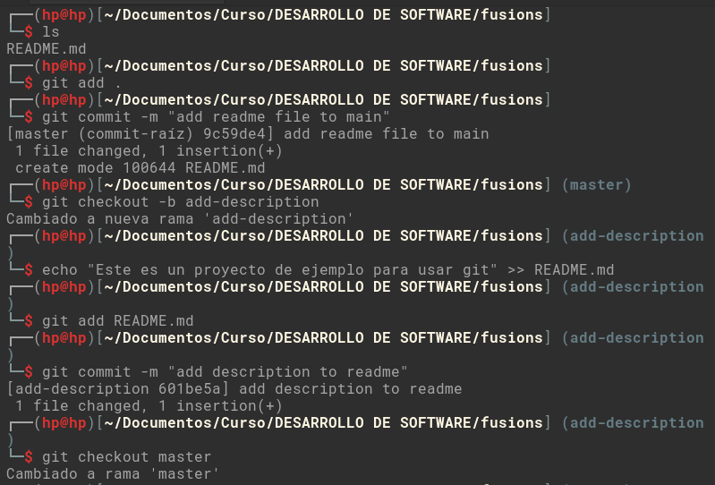
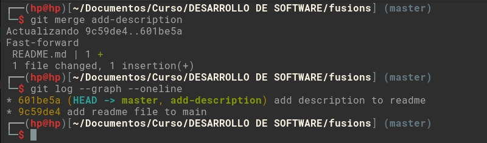
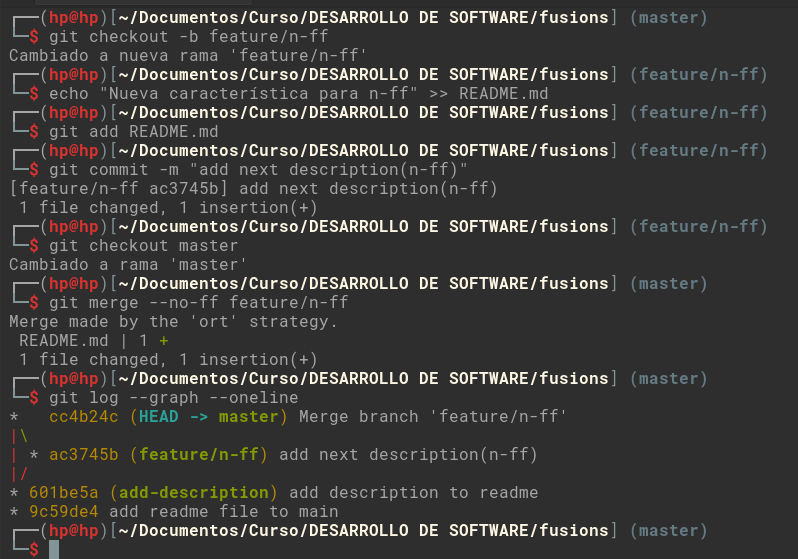
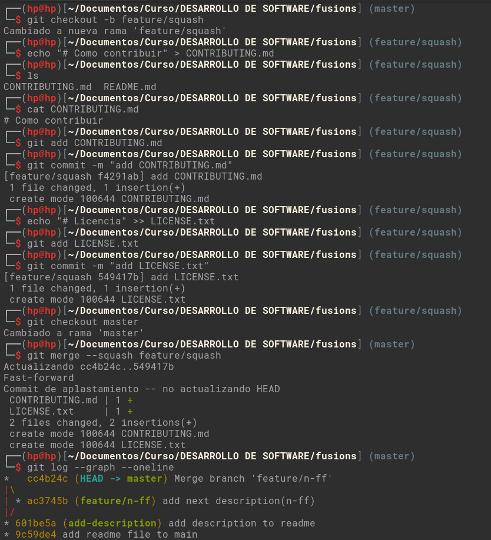
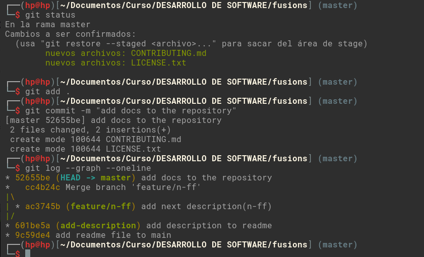

## Fusiones en Git

### 1. Fusión Fast-forward (git merge --ff)

```bash
# Creamos un directorio de trabajo y nos posicionamos en el directorio
mkdir fusions && cd fusions

# inicializamos Git
git init

# Agregamos el archivo README.md
echo "# mi Proyecto" > README.md

# Confirmamos los cambios
git add README.md
git commit -m "add readme file to master"

# Generamos una rama de trabajo a partir de master
git checkout -b add-description

# Realizamos cambios en README.md
echo "Este es un proyecto de ejemplo para usar git" >> README.md

# Confirmamos los cambios
git add README.md
git commit -m "add description to readme"

# Regresamos a la rama master
git checkout master

# Realizamos la fusión
git merge add-description

# Mostramos el historia de commits
git log --graph --oneline
```





### 2. Fusión No-fast-forward (git merge --no-ff)

```bash
# Generamos rama para --no-ff a partir de master
git checkout -b feature/n-ff

# agregamos cambios en README.md
echo "Nueva característica para n-ff" >> README.md

# Confirmamos los cambios
git add README.md
git commit -m "add next description(n-ff)" 

# Regresamos a la rama master
git checkout master

# Realizamos la fusión --no-ff
git merge --no-ff feature/n-ff

# Mostramos el historia de commits y ver diferencia
git log --graph --oneline
```



### 3. Fusión squash (git merge --squash)

```bash
# Generamos rama para squash a partir de master
git checkout -b feature/squash

# Creamos nuevo archivo CONTRIBUTING.md
echo "# Como contribuir" > CONTRIBUTING.md

# Confirmamos los cambios
git add CONTRIBUTING.md
git commit -m "add CONTRIBUTING.md" 

# Creamos nuevo archivo LICENSE.txt
echo "# Licencia" >> LICENSE.txt

# Confirmamos los cambios
git add LICENSE.txt
git commit -m "add LICENSE.txt" 

# Regresamos a la rama master
git checkout master

# Realizamos la fusión --squash
git merge --squash feature/squash

# Mostramos el historia de commits y ver diferencia
git log --graph --oneline

# Confirmamos el squash
git add .
git commit -m "add docs to the repository"

# Volvemos a mostramos el historia de commits para ver diferencia
git log --graph --oneline
```



