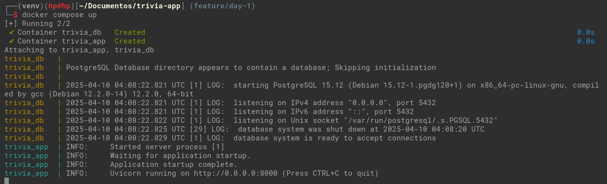
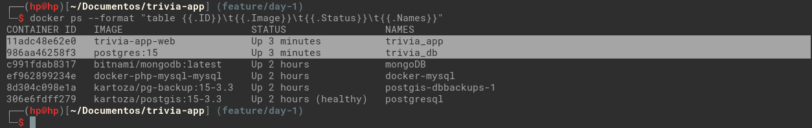
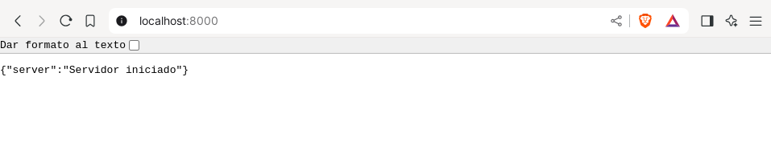
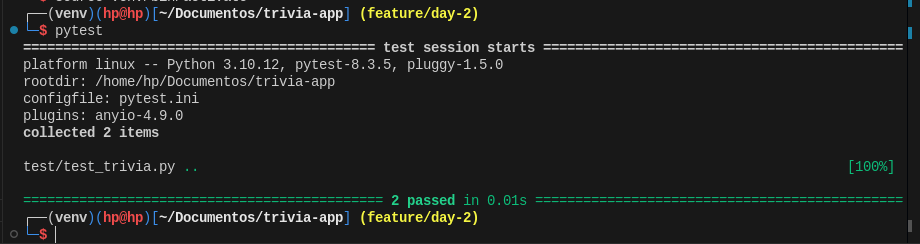
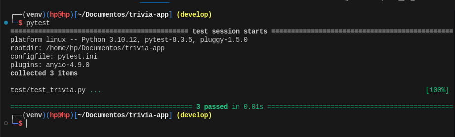
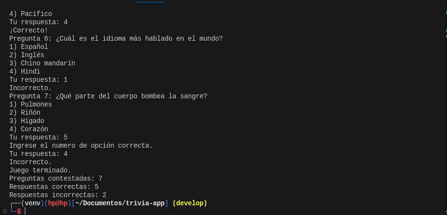

# Prueba de entrada

La prueba de entrada consiste en un proyecto completo: Juego de Trivia con FastAPI, PostgreSQL y DevOps.

Esto se realizara por tareas que se realizaran por día, y se ira registrando paso a paso.

El proyecto consta con una [descripción] detallada de los pasos a seguir, y los avances se irán subiendo al [repositorio] del proyecto.

## Seguimiento de tareas:

### day-1

  **Pull Request**: [feature/day-1]

  - Definimos la estructura del proyecto que utilizaremos.

      ```bash
      trivia-app/
      │
      ├── src/
      │   ├── main.py
      │   ├── db.py
      │   ├── trivia.py
      │   └── ...
      ├── test/
      │   ├─ test_trivia.py
      │   └── ...
      │
      ├── .gitignore
      ├── Dockerfile          
      ├── docker-compose.yml
      ├── requirements.txt
      ├── pytest.ini
      └── README.md
      ```

  - Comandos utilizados para la creación del proyecto e inicializaron de git.

    ```bash
    # Creamos el directorio del proyecto y navegamos a el
    mkdir trivia-app && cd trivia-app

    # Creamos el directorio que contendrá el app
    mkdir src

    # creamos los archivos iniciales
    touch src/main.py src/db.py Dockerfile docker-compose.yml README.md .gitignore

    # creamos el entorno virtual
    python3 -m venv venv

    # activamos entorno virtual
    source venv/bin/active

    # instalamos dependencias
    pip install fastapi uvicorn asyncpg databases

    # generamos un archivo con dependencias exactas
    pip freeze > requirements.txt

    # Inicializamos repositorio
    git init

    # iniciando commit para el historial
    git add README.md
    git commit -m "inicio de proyecto"

    # Agregamos el repositorio remoto
    git remote add origin url_repositorio_remoto

    # Subimos cambios al repositorio remoto
    git push -u origin master

    # Creamos la rama de trabajo para day-1
    git checkout -b feature/day-1

    # continuamos agregando commits por los cambios realizados
    git add .
    git commit -m "configurando el entorno virtual"

    # repetimos para todos los cambios
    ```
    
  - Contenido de .gitignore para no subir archivos innecesarios al repositorio remoto

    ```bash
    # No se requiere subir la carpeta del entorno virtual por muchas razones
    # Solo es valido en el SO que se creo, ocupa espacio, es fácil de construir
    # Solo requerimos las dependencias instaladas que ya están en requirements.txt
    venv/
    
    # Carpeta creada por python, no es necesario
    **/__pycache__

    # Archivo para manejar las variables de entorno, no se sube por seguridad.
    # Exponer datos sensibles
    .env
    ```

  - Contenido del Docker file con los pasos asta el momento (Avance).

    ```Dockerfile
    FROM python:3.11-slim

    # Establecer directorio de trabajo
    WORKDIR /src

    # Copiamos el archivos de requerimientos
    COPY requirements.txt .

    # Instalación limpia de dependencias
    RUN pip install --no-cache-dir -r requirements.txt

    # Copiar código de aplicación
    COPY ./src ./src

    # Ejecutamos nuestra app
    CMD ["uvicorn", "src.main:app", "--host", "0.0.0.0", "--port", "8000"]
    ```

  - Contenido del docker-compose.yaml según lo pedido (Avance).

    ```yaml
    services:
      db:
        image: postgres:15
        container_name: trivia_db
        environment:
          POSTGRES_USER: admin
          POSTGRES_PASSWORD: admin
          POSTGRES_DB: trivia
        ports:
          - "9000:5432"
        volumes:
          - postgres_data:/var/lib/postgresql/data

      web:
        build: .
        container_name: trivia_app
        ports:
          - "8000:8000"
        # Garantiza que primero se construya el contenedor de DB
        depends_on:
          - db

    volumes:
      postgres_data:
    ```

  - Contenido de main.py para ejecutar el servidor y poder corroborar que app se ejecuta

    ```python
    from fastapi import FastAPI

    app = FastAPI()

    # endpoint raíz para comprobar que el servicio este ejecutando
    @app.get('/')
    def home():
      return {"server": "Servidor iniciado"}

    ```

    Para ejecutar el app lo hacemos con el comando `uvicorn src.main:app`, utilizando el entorno virtual.

    Otra manera es utilizar docker compose, lo hacemos con el comando `docker compose up`, no es necesario el entorno virtual.

  - evidencia para ejecutar la aplicación con docker compose
    
    Ejecutado el comando de `docker compose up`

    

    Verificando que los contenedores se estén ejecutando, con el comando `docker ps`

    

    Verificamos desde un navegador que la aplicación este funcionando

    

### day-2

**Pull Request**: [feature/day-2]

  - Se agrego el archivo **trivia.py**, en la cual se implemento la clase **Question**, el cual representa a la representa a la pregunta del juego, este maneja la pregunta, las opciones y la respuesta a la pregunta.

    ```python
    from typing import List

    class Question:

      def __init__(self, question: str, options: List[str], correct_answer: str) -> None:
        self.question = question
        self.options = options
        self.correct_answer = correct_answer

      def is_correct(self, answer: str) -> bool:
        return self.correct_answer == answer
    ```
  - Implementación de las pruebas unitarias para la clase Question (*test_trivia.py*), en la cual se realiza dos pruebas, una para cuando respondemos correctamente a la pregunta y otra para una respuesta incorrecta.

    ```python
    from trivia import Question

    # Verificamos que devuelva true cuando se le pase respuesta correcta
    def test_question_correct_answer():
      question = Question("What is 2 + 2?", ["1", "2", "3", "4"], "4")
      assert question.is_correct("4")

    # Verificamos que devuelva false cuando se le pase respuesta incorrecta
    def test_question_incorrect_answer():
      question = Question("What is 2 + 2?", ["1", "2", "3", "4"], "4")
      assert not question.is_correct("2")
    ```  

  - Para ejecutar las pruebas unitaria, se requirió instalar la librería `pytest` en nuestro entorno virtual.

    ```bash
    pip install pytest
    ```

  - Agregando archivo `pytest.ini` cara configurar la importación de las clases en los test unitarios, se requirió hacer esto, ya que optamos por colocar los script `test_*.py` en una carpeta llamada `test`, por lo cual tuvimos problemas para importar la clase *Question*, con esta configuración, decimos a *pytest* que los módulos a importar lo busque en src.

    ```bash
    [pytest]
    pythonpath=src
    ```

    Ejecución de pruebas unitarias.

    

### day-3

**Pull Request**: [feature/day-2]

- Se agrego implementación de la clase **Quiz**, en el archivo *trivia.py*, la cual consta de 5 métodos:
  
  - **add_question**: Método para agrega preguntas a la lista del juego.

  - **get_next_question**: Método para obtiene la siguiente pregunta del juego.
  - **answer_question**: Método para verifica la respuesta del jugador y actualizar los contadores de respuestas correctas e incorrectas.
  - **show_question_results**: Método pra mostrar resultados del juego.
  - **start_quiz**: Método para inicia el juego de trivia mostrando las preguntas una a una en consola, solicitando la respuesta del jugador.

- Se agrego pruebas unitarias para clase Quiz, la cual verifica que al responder correctamente, el contador de respuestas correctas se incremente en 1, de la misma manera, el contador de respuesta incorrectas.

  ```python
  def test_quiz_scoring():
    quiz = Quiz()
    question = Question("What is 2 + 2?", ["1", "2", "3", "4"], "4")
    # Agregamos pregunta al juego
    quiz.add_question(question)
    # Evaluamos pregunta respondida correctamente
    assert quiz.answer_question(question, "4") == True
    # Verificamos el contador de repuesta correcta
    assert quiz.correct_answers == 1
    # Evaluamos pregunta respondida incorrectamente
    assert quiz.answer_question(question, "1") == False
    # Verificamos el contador de repuesta incorrecta
    assert quiz.incorrect_answers == 1
  ```

  Ejecución del test.

  

- Se modifico archivo main, en la cual se agrego una prueba de Inicialización del juego con ciertas preguntas y verificar el funcionamiento del juego ``trivia``.

  ```python
  from trivia import Question, Quiz

  if __name__ == "__main__":

    # Preguntas propuestas
    question_bank = [
      Question("¿Cuál es la capital de Francia?", ["Madrid", "Londres", "París", "Berlín"], "París"),
      Question("¿En qué país se encuentra la Torre Eiffel?", ["Italia", "Francia", "España", "Alemania"], "Francia"),
      Question("¿Quién escribió 'Cien años de soledad'?", ["Mario Vargas Llosa", "Gabriel García Márquez", "Julio Cortázar", "Pablo Neruda"], "Gabriel García Márquez"),
      Question("¿Cuál es el resultado de 7 x 8?", ["54", "56", "64", "58"], "56"),
      Question("¿Cuál es el océano más grande del mundo?", ["Atlántico", "Índico", "Ártico", "Pacífico"], "Pacífico"),
      Question("¿Cuál es el idioma más hablado en el mundo?", ["Español", "Inglés", "Chino mandarín", "Hindi"], "Inglés"),
      Question("¿Qué parte del cuerpo bombea la sangre?", ["Pulmones", "Riñón", "Hígado", "Corazón"], 4),
    ]
    
    quiz = Quiz()
    
    # Agregamos las preguntas a la lista del juego
    for question in question_bank:
      quiz.add_question(question)
    
    # Iniciamos el juego
    quiz.start_quiz()
  ```

  Captura del juego en marcha, mostrando ingreso de respuesta validas y una con respuesta invalida, en la cual se pide que ingrese una opción correcta, al finalizar el juego muestra el resultado.

  

[Descripción]: Enunciado_Prueba_Entrada
[repositorio]: https://github.com/izarra-ch/trivia-app
[feature/day-1]: https://github.com/izarra-ch/trivia-app/pull/1
[feature/day-2]: https://github.com/izarra-ch/trivia-app/pull/2
[feature/day-3]: https://github.com/izarra-ch/trivia-app/pull/3