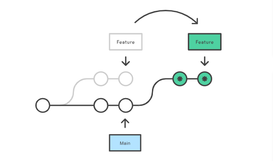
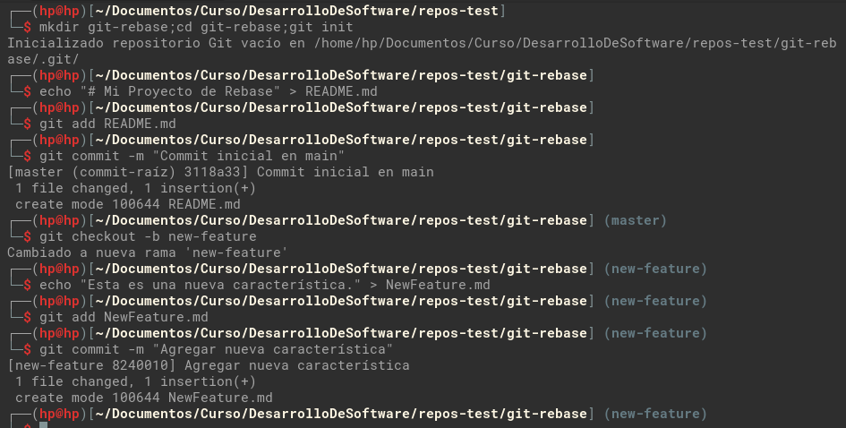
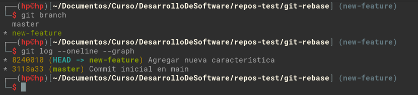
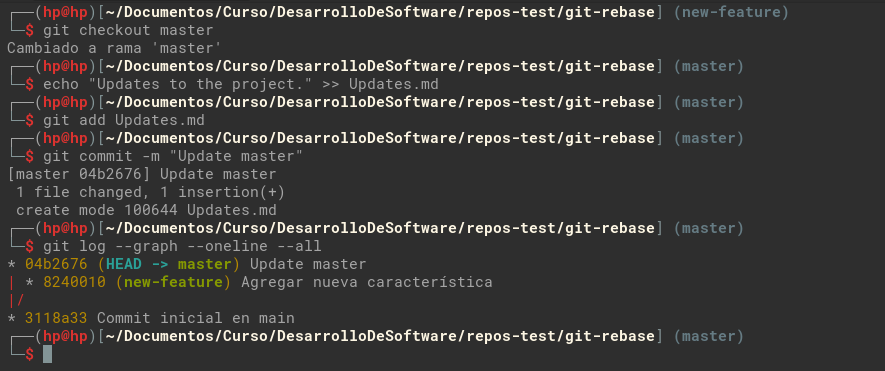
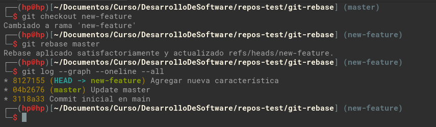
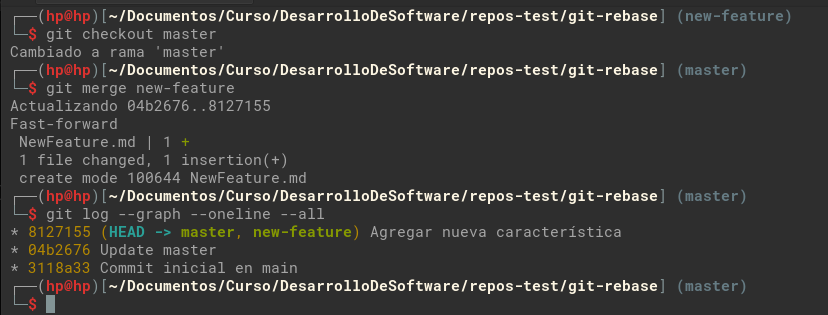
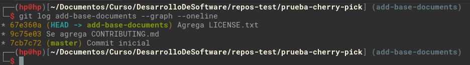
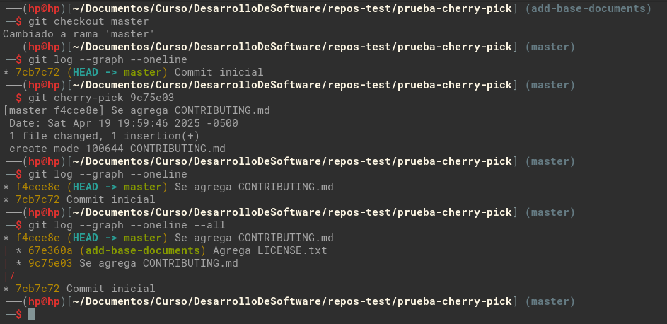

## Rebase, Cherry-Pick y CI/CD en un entorno ágil

### Parte 1: git rebase para mantener un historial lineal

Git rebase nos permite integrar cambios de una rama a otra, es decir, movemos o combinamos una secuencia de confirmaciones que se hicieron en la rama base, a la rama actual con la que aun no se cuenta.



Mostramos escenario del ejemplo proporcionado.

* Crea un nuevo repositorio Git y dos ramas, main y new-feature:

  ```bash
  mkdir git-rebase;cd git-rebase;git init
  echo "# Mi Proyecto de Rebase" > README.md
  git add README.md
  git commit -m "Commit inicial en main"

  # creamos nueva rama a partir de master y agregamos cambio

  git checkout -b new-feature
  echo "Esta es una nueva característica." > NewFeature.md
  git add NewFeature.md
  git commit -m "Agregar nueva característica"
  ```

  

  Mostramos el historial de ramas y confirmaciones que tenemos por el momento.

  

  Ahora, agregamos nuevos commits a main, con esto hacemos que la rama `new-feature` no tenga los cambios que agregaremos.

  ```bash
  git checkout main
  echo "Updates to the project." >> Updates.md
  git add Updates.md
  git commit -m "Update master"

  # verificamos el historial de cambios
  git log --graph --oneline --all
  ```
  
  

  Como vemos en la salida del historial de cambios, vemos que el commit `04b2676` es nuevo en la rama `master`, pero este commit no se encuentra en la rama `new-feature`, con rebase lo que aremos es registra dicho cambio en la rama `new-feature`

  ```bash
  # Nos posicionamos en la rama new-feature
  git checkout new-feature

  # realizamos el rebase
  git rebase master

  # revisamos el historial
  git log --graph --oneline --all
  ```

  

  Ahora podemos ver que el historial de confirmaciones ya es lineal, por que la rama `new-feature` ya cuenta con los últimos cambios de `master`.

  Realizamos la fusión y completar el proceso de rebase.

  ```bash
  git checkout master
  git merge new-feature

  git log --graph --oneline --all
  ```
  

### Parte 2: git cherry-pick para la integración selectiva de commit

`cherry-pick` permite que las confirmaciones que se realizaron, se elijan por referencia y se añadan al actual HEAD de trabajo.

Mostramos un escenario de ejemplo proporcionado.

* Creamos repositorio para el ejemplo con las confirmaciones necesarias.

  ```bash
  # Creamos nuevo repositorio e inicializamos git
  mkdir prueba-cherry-pick;cd prueba-cherry-pick;git init

  # Agregamos primer cambio y registramos commit en master
  echo "# Mi Proyecto" > README.md
  git add README.md
  git commit -m "Commit inicial"

  # Creamos nueva rama 'add-base-documents' y agregamos commits
  git checkout -b add-base-documents
  echo "# CONTRIBUTING" >> CONTRIBUTING.md
  git add CONTRIBUTING.md
  git commit -m "Se agrega CONTRIBUTING.md"

  echo "LICENSE" >> LICENSE.txt
  git add LICENSE.txt
  git commit -m "Agrega LICENSE.txt"
  ```

  

  ```bash
  # Echa un vistazo al log de la rama 'add-base-documents'
  git log add-base-documents --graph --oneline
  ```

  

  Agregamos un diagrama de como tenemos los commits por el momento

  ```bash
  7cb7c72   #master
      \
        9c75e03 - 67e360a  #add-base-documents
  ```

  Ahora realizamos un `cherry-pick` del commit `9c75e03` de la rama `add-base-documents` a master

  ```
  # Posicionamos en la rama master
  git checkout master

  # Mostramos los commit antes del cherry-pick
  git log --graph --oneline

  # Realizamos el cherry-pick
  git cherry-pick 9c75e03

  # Mostramos los commit en master
  git log --graph --oneline

  # Mostramos los commit de todas las ramas
  git log --graph --oneline --all
  ```

  

  Como vemos en la salida, el commit `9c75e03` de la rama `add-base-documents` se copio/movió a la rama `master` como un nuevo commit `f4cce8e`, mostrando en un diagrama lo que tenemos, seria el siguiente:

  ```
            (9c75e03)
  7cb7c72 -  f4cce8e    #master
      \
        9c75e03 - 67e360a  #add-base-documents
  ```

  Preguntas:

  1. ¿Por qué se considera que rebase es más útil para mantener un historial de proyecto lineal en comparación con merge?

      Recordemos que merge agrega commit de fusión en el historial(commit del merge), que serian innecesarias para un historial lineal, y rebase no hace esto, sino reescribe el historial aplicando los commits de una rama sobre otra en línea recta, pero con un hash distinto sin agregar commit extra por lo cual el historial queda mas limpio .

  2. ¿Qué problemas potenciales podrían surgir si haces rebase en una rama compartida con otros miembros del equipo?

      - Hay la posibilidad de que haya conflictos al momento del rebase, por que los desarrolladores modificaron las mismas lineas de código en un fichero, si los cambios son extensos, seria necesario la intervención de los dos desarrolladores que realizaron los cambios para solucionarlo.
      - También tenemos el caso donde los desarrolladores, al actualizar sus ramas, haya problemas debido a las diferencias del historial antiguo y el nuevo, lo cual lleva a resolver estas diferencias de manera manual, incluso pueda ser tedioso resolver estos.

  3. ¿En qué se diferencia cherry-pick de merge, y en qué situaciones preferirías uno sobre el otro?

      `cherry-pick` copia  los cambios de un commit en especifico de la rama a otra, mientra que merge fusiona todo los commit de la rama, ademas en este proceso, cherry-pick crea nuevos hash para el commit copiado y merge mantiene los los hash.

  4. ¿Por qué es importante evitar hacer rebase en ramas públicas?

      principalmente por los conflictos que pueden presentarse, las cuales se tienen que resolver de manera manual y resolverlos puede llegar a ser tedioso.

  Ejercicios teóricos:

  1. **Diferencias entre git merge y git rebase**

      Explica la diferencia entre git merge y git rebase y describe en qué escenarios sería más adecuado utilizar cada uno en un equipo de desarrollo ágil que sigue las prácticas de Scrum.

      Tomemos el siguiente caso para explicar la diferencia entre estos dos, git merge y git rebase.

      ```
      A - B - C - D    #master
           \
            E - F - G  #Feature
      ```
      merge fusiona los commit de una rama sobre otra, generalmente merge se aplica sobre una rama publica, para tener los commit actualizados, por tanto merge escribe los commit E, F y G en master, ademas de agregar un commit M, que es el commit de fusión.

      Mientras que rebase, no se usa sobre una rama publica, por tanto se realizar rebase sobre feature, y lo que hace es actualizar los commit de la rama base(master) en la rama de trabajo(Feature), para tener los cambios que no se registraron al momento de sacar la bifurcación, es decir, que rebase copia los commit C y D en Feature. 
 
  2. **Relación entre git rebase y DevOps**
      
      ¿Cómo crees que el uso de git rebase ayuda a mejorar las prácticas de DevOps, especialmente en la implementación continua (CI/CD)? Discute los beneficios de mantener un historial lineal en el contexto de una entrega continua de código y la automatización de pipelines.

      git rebase ayuda a la practica de DevOps debido a que con esto tenemos un historial mas claro y evitamos los conflictos que puedan suceder al trabajar de forma colaborativa, por ejemplo, supongamos que dos desarrolladores realizaron dos funcionalidades, A y B, la funcionalidad A se termino primero, por lo cual se fusiono en master, CI/CO realiza el flujo de trabajo sobre los commit de A, y pasa sin problemas, luego termina de implementarse B, por lo cual se fusiona en master, como master ya tiene nuevos commit aquí se puede dar casos de conflictos, o sobrescribir o quitar cambios de A, por lo que CI/CO al ejecutar el flujo de integración genera errores, por lo que si se utiliza rebase antes de todo lo anterior reduce en gran medida posibles fallos, y tenemos historiales mas claros evitando conflictos entre commit antiguos y nuevos.

  3. **Impacto del git cherry-pick en un equipo Scrum**
      
      Un equipo Scrum ha finalizado un sprint, pero durante la integración final a la rama principal (main) descubren que solo algunos commits específicos de la rama de una funcionalidad deben aplicarse a producción. ¿Cómo podría ayudar git cherry-pick en este caso? Explica los beneficios y posibles complicaciones.

      En este caso, cherry-pick ayuda copiando solo los cambios de commit en especifico a main, descartando los commit que no se requieran pasar a producción evitando merge innecesarios, pero realizar esto podría traer algunas complicaciones, como por ejemplo, si un cambio de un commit en especifico, depende de un cambio previo, por lo cual generaría conflictos, en el peor de los casos, no genere conflictos pero rompa el código.

