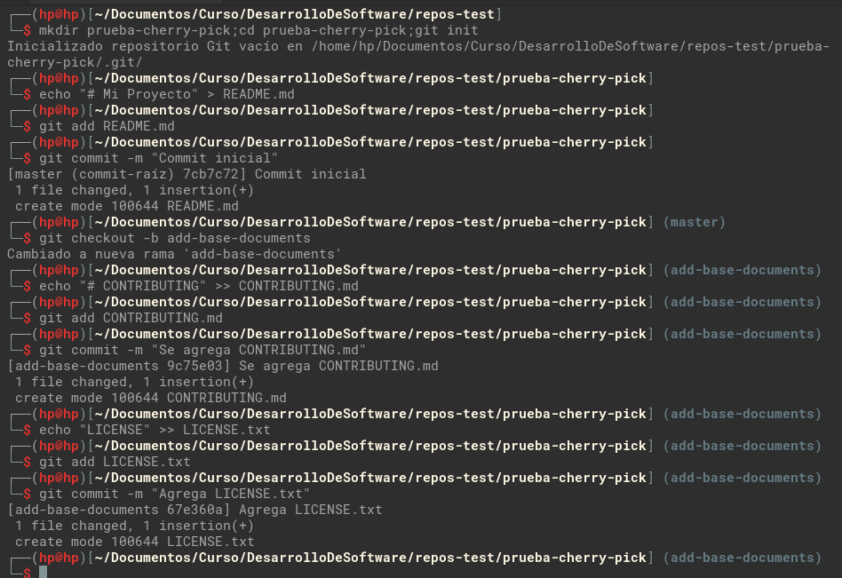
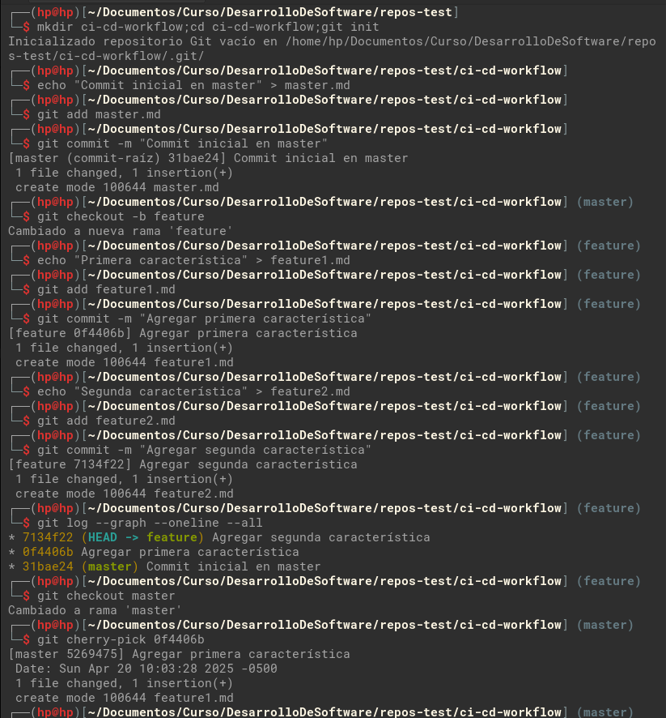
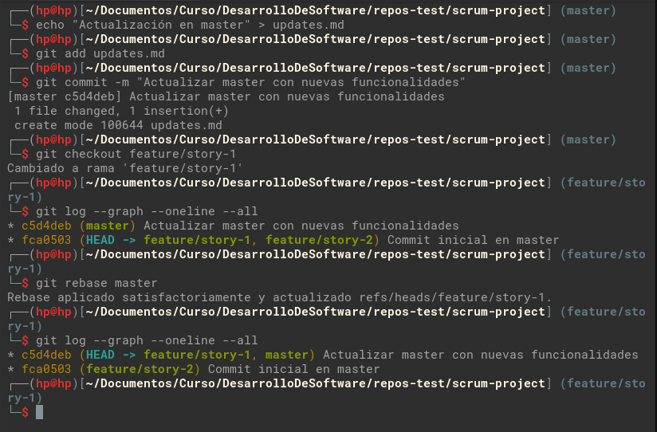

## Rebase, Cherry-Pick y CI/CD en un entorno ágil

### Parte 1: git rebase para mantener un historial lineal

Git rebase nos permite integrar cambios de una rama a otra, es decir, movemos o combinamos una secuencia de confirmaciones que se hicieron en la rama base, a la rama actual con la que aun no se cuenta.


Mostramos escenario del ejemplo proporcionado.

* Crea un nuevo repositorio Git y dos ramas, main y new-feature:

  ```bash
  mkdir git-rebase;cd git-rebase;git init
  echo "# Mi Proyecto de Rebase" > README.md
  git add README.md
  git commit -m "Commit inicial en main"

  # creamos nueva rama a partir de master y agregamos cambio

  git checkout -b new-feature
  echo "Esta es una nueva característica." > NewFeature.md
  git add NewFeature.md
  git commit -m "Agregar nueva característica"
  ```

  

  Mostramos el historial de ramas y confirmaciones que tenemos por el momento.

  

  Ahora, agregamos nuevos commits a main, con esto hacemos que la rama `new-feature` no tenga los cambios que agregaremos.

  ```bash
  git checkout main
  echo "Updates to the project." >> Updates.md
  git add Updates.md
  git commit -m "Update master"

  # verificamos el historial de cambios
  git log --graph --oneline --all
  ```
  
  

  Como vemos en la salida del historial de cambios, vemos que el commit `04b2676` es nuevo en la rama `master`, pero este commit no se encuentra en la rama `new-feature`, con rebase lo que aremos es registra dicho cambio en la rama `new-feature`

  ```bash
  # Nos posicionamos en la rama new-feature
  git checkout new-feature

  # realizamos el rebase
  git rebase master

  # revisamos el historial
  git log --graph --oneline --all
  ```

  

  Ahora podemos ver que el historial de confirmaciones ya es lineal, por que la rama `new-feature` ya cuenta con los últimos cambios de `master`.

  Realizamos la fusión y completar el proceso de rebase.

  ```bash
  git checkout master
  git merge new-feature

  git log --graph --oneline --all
  ```
  

### Parte 2: git cherry-pick para la integración selectiva de commit

`cherry-pick` permite que las confirmaciones que se realizaron, se elijan por referencia y se añadan al actual HEAD de trabajo.

Mostramos un escenario de ejemplo proporcionado.

* Creamos repositorio para el ejemplo con las confirmaciones necesarias.

  ```bash
  # Creamos nuevo repositorio e inicializamos git
  mkdir prueba-cherry-pick;cd prueba-cherry-pick;git init

  # Agregamos primer cambio y registramos commit en master
  echo "# Mi Proyecto" > README.md
  git add README.md
  git commit -m "Commit inicial"

  # Creamos nueva rama 'add-base-documents' y agregamos commits
  git checkout -b add-base-documents
  echo "# CONTRIBUTING" >> CONTRIBUTING.md
  git add CONTRIBUTING.md
  git commit -m "Se agrega CONTRIBUTING.md"

  echo "LICENSE" >> LICENSE.txt
  git add LICENSE.txt
  git commit -m "Agrega LICENSE.txt"
  ```

  

  ```bash
  # Echa un vistazo al log de la rama 'add-base-documents'
  git log add-base-documents --graph --oneline
  ```

  

  Agregamos un diagrama de como tenemos los commits por el momento

  ```bash
  7cb7c72   #master
      \
        9c75e03 - 67e360a  #add-base-documents
  ```

  Ahora realizamos un `cherry-pick` del commit `9c75e03` de la rama `add-base-documents` a master

  ```
  # Posicionamos en la rama master
  git checkout master

  # Mostramos los commit antes del cherry-pick
  git log --graph --oneline

  # Realizamos el cherry-pick
  git cherry-pick 9c75e03

  # Mostramos los commit en master
  git log --graph --oneline

  # Mostramos los commit de todas las ramas
  git log --graph --oneline --all
  ```

  

  Como vemos en la salida, el commit `9c75e03` de la rama `add-base-documents` se copio/movió a la rama `master` como un nuevo commit `f4cce8e`, mostrando en un diagrama lo que tenemos, seria el siguiente:

  ```
            (9c75e03)
  7cb7c72 -  f4cce8e    #master
      \
        9c75e03 - 67e360a  #add-base-documents
  ```

  Preguntas:

  1. ¿Por qué se considera que rebase es más útil para mantener un historial de proyecto lineal en comparación con merge?

      Recordemos que merge agrega commit de fusión en el historial(commit del merge), que serian innecesarias para un historial lineal, y rebase no hace esto, sino reescribe el historial aplicando los commits de una rama sobre otra en línea recta, pero con un hash distinto sin agregar commit extra por lo cual el historial queda mas limpio .

  2. ¿Qué problemas potenciales podrían surgir si haces rebase en una rama compartida con otros miembros del equipo?

      - Hay la posibilidad de que haya conflictos al momento del rebase, por que los desarrolladores modificaron las mismas lineas de código en un fichero, si los cambios son extensos, seria necesario la intervención de los dos desarrolladores que realizaron los cambios para solucionarlo.
      - También tenemos el caso donde los desarrolladores, al actualizar sus ramas, haya problemas debido a las diferencias del historial antiguo y el nuevo, lo cual lleva a resolver estas diferencias de manera manual, incluso pueda ser tedioso resolver estos.

  3. ¿En qué se diferencia cherry-pick de merge, y en qué situaciones preferirías uno sobre el otro?

      `cherry-pick` copia  los cambios de un commit en especifico de la rama a otra, mientra que merge fusiona todo los commit de la rama, ademas en este proceso, cherry-pick crea nuevos hash para el commit copiado y merge mantiene los los hash.

  4. ¿Por qué es importante evitar hacer rebase en ramas públicas?

      principalmente por los conflictos que pueden presentarse, las cuales se tienen que resolver de manera manual y resolverlos puede llegar a ser tedioso.

  Ejercicios teóricos:

  1. **Diferencias entre git merge y git rebase**

      Explica la diferencia entre git merge y git rebase y describe en qué escenarios sería más adecuado utilizar cada uno en un equipo de desarrollo ágil que sigue las prácticas de Scrum.

      Tomemos el siguiente caso para explicar la diferencia entre estos dos, git merge y git rebase.

      ```
      A - B - C - D    #master
           \
            E - F - G  #Feature
      ```
      merge fusiona los commit de una rama sobre otra, generalmente merge se aplica sobre una rama publica, para tener los commit actualizados, por tanto merge escribe los commit E, F y G en master, ademas de agregar un commit M, que es el commit de fusión.

      Mientras que rebase, no se usa sobre una rama publica, por tanto se realizar rebase sobre feature, y lo que hace es actualizar los commit de la rama base(master) en la rama de trabajo(Feature), para tener los cambios que no se registraron al momento de sacar la bifurcación, es decir, que rebase copia los commit C y D en Feature. 
 
  2. **Relación entre git rebase y DevOps**
      
      ¿Cómo crees que el uso de git rebase ayuda a mejorar las prácticas de DevOps, especialmente en la implementación continua (CI/CD)? Discute los beneficios de mantener un historial lineal en el contexto de una entrega continua de código y la automatización de pipelines.

      git rebase ayuda a la practica de DevOps debido a que con esto tenemos un historial mas claro y evitamos los conflictos que puedan suceder al trabajar de forma colaborativa, por ejemplo, supongamos que dos desarrolladores realizaron dos funcionalidades, A y B, la funcionalidad A se termino primero, por lo cual se fusiono en master, CI/CO realiza el flujo de trabajo sobre los commit de A, y pasa sin problemas, luego termina de implementarse B, por lo cual se fusiona en master, como master ya tiene nuevos commit aquí se puede dar casos de conflictos, o sobrescribir o quitar cambios de A, por lo que CI/CO al ejecutar el flujo de integración genera errores, por lo que si se utiliza rebase antes de todo lo anterior reduce en gran medida posibles fallos, y tenemos historiales mas claros evitando conflictos entre commit antiguos y nuevos.

  3. **Impacto del git cherry-pick en un equipo Scrum**
      
      Un equipo Scrum ha finalizado un sprint, pero durante la integración final a la rama principal (main) descubren que solo algunos commits específicos de la rama de una funcionalidad deben aplicarse a producción. ¿Cómo podría ayudar git cherry-pick en este caso? Explica los beneficios y posibles complicaciones.

      En este caso, cherry-pick ayuda copiando solo los cambios de commit en especifico a main, descartando los commit que no se requieran pasar a producción evitando merge innecesarios, pero realizar esto podría traer algunas complicaciones, como por ejemplo, si un cambio de un commit en especifico, depende de un cambio previo, por lo cual generaría conflictos, en el peor de los casos, no genere conflictos pero rompa el código.

### Ejercicios prácticos

1. Simulación de un flujo de trabajo Scrum con git rebase y git merge.

    **Contexto**:
    Tienes una rama master y una rama feature en la que trabajas. Durante el desarrollo del sprint, se han realizado commits tanto en master como en feature.

    Tu objetivo es integrar los cambios de la rama feature en master manteniendo un historial limpio.

    **Instrucciones**:

    - Crea un repositorio y haz algunos commits en la rama master.
    - Crea una rama feature, agrega nuevos commits, y luego realiza algunos commits adicionales en master.
    - Realiza un rebase de feature sobre master.
    - Finalmente, realiza una fusión fast-forward de feature con master.

    **Comandos utilizados**:

    ```bash
    # Creamos repositorio y generamos primer commit
    mkdir scrum-workflow;cd scrum-workflow;git init
    echo "Commit inicial en master" > masterfile.md
    git add masterfile.md
    git commit -m "Commit inicial en master"

    # Generamos nueva rama a partir de master y agregamos nuevo commit
    git checkout -b feature
    echo "Nueva característica en feature" > featurefile.md
    git add featurefile.md
    git commit -m "Commit en feature"

    # Retornamos a master para agregar nuevo commit con el que no contara la rama feature
    git checkout master
    echo "Actualización en master" >> masterfile.md
    git add masterfile.md
    git commit -m "Actualización en master"

    # Vemos como queda el historial de commit
    git log --graph --oneline --all

    # Retornamos a feature para actualizar los commit de la rama base (master)
    git checkout feature
    git rebase master

    # Vemos como queda el historial de commit luego de rebase
    git log --graph --oneline --all
    
    # Por ultimo realizamos el merge en master de feature
    git checkout master
    git merge feature --ff-only

    # Vemos como queda el historial de commit luego de merge
    git log --graph --oneline --all
    ```

    

    

    **Preguntas**:

    - ¿Qué sucede con el historial de commits después del rebase?

        Como vimos en el historial de commit mostrados con `log`, antes del rebase teníamos una bifurcación de la rama `feature` ya que no contaba el ultimo commit de `master`, luego del rebase, vimos el historial de commit se mostró de forma lineal.

    - ¿En qué situación aplicarías una fusión fast-forward en un proyecto ágil?

        `fast-forward` se aplica en un proyecto donde queremos mantener un historial limpio y lineal sin commits de merge adicionales, para tener un historial mas claro, ademas de utilizar en ramas de corta duración o hotfixes que queremos integrar rápidamente.

2. Cherry-pick para integración selectiva en un pipeline CI/CD

    **Contexto**:
    Durante el desarrollo de una funcionalidad, te das cuenta de que solo ciertos cambios deben ser integrados en la rama de producción, ya que el resto aún está en desarrollo. Para evitar fusionar toda la rama, decides hacer cherry-pick de los commits que ya están listos para producción.

    **Instrucciones**:

    - Crea un repositorio con una rama master y una rama feature.
    - Haz varios commits en la rama feature, pero solo selecciona uno o dos commits específicos que consideres listos para producción.
    - Realiza un cherry-pick de esos commits desde feature a master.
    - Verifica que los commits cherry-picked aparezcan en master.
    
    **Comandos utilizados**:

    ```bash
    # Creamos repositorio y generamos primer commit
    mkdir ci-cd-workflow;cd ci-cd-workflow;git init
    echo "Commit inicial en master" > master.md
    git add master.md
    git commit -m "Commit inicial en master"

    # Generamos nueva rama a partir de master y agregamos nuevo commit
    git checkout -b feature
    echo "Primera característica" > feature1.md
    git add feature1.md
    git commit -m "Agregar primera característica"

    echo "Segunda característica" > feature2.md
    git add feature2.md
    git commit -m "Agregar segunda característica"

    # Mostramos historial de commit hasta el momento
    git log --graph --oneline --all

    # Nos posicionamos en master
    git checkout master

    # Realizamos cherry-pick (1er) y mostramos historial de commit
    git cherry-pick 0f4406b
    git log --graph --oneline --all

    # Realizamos cherry-pick (2do) y mostramos historial de commit
    git cherry-pick 7134f22
    git log --graph --oneline --all
    ```

    

    


    **Preguntas**:

    - ¿Cómo utilizarías cherry-pick en un pipeline de CI/CD para mover solo ciertos cambios listos a producción?

      Un pipeline de CI/CD se dispara cuando ingresa un nuevo cambio en la rama publica (master, main, develop) por lo general, en este sentido, utilizamos cherry-pick para mandar solo cambios de commit listos para producción de una rama de trabajo X, a la rama publica, esto dispara el pipeline de CI/CD, incluso se puede trabajar con script que revisen los commit registrados y reconociendo ciertos atributos, como tag, mensajes de commit, entre otros; implemente todo un flujo automatizado para mandar cambios a producción.

    - ¿Qué ventajas ofrece cherry-pick en un flujo de trabajo de DevOps?

      Las ventajas de cherry-pick son varias, una de las cuales es, flexibilidad en la integración de cambios, ya que permite incorporar o copiar cambios de commits específicos sin fusionar ramas completas, por lo cual es ideal para corregir bugs e implementar parches de manera mas clara.
      
### Git, Scrum y Sprints

- **Ejercicio 1**: Crear ramas de funcionalidades (feature branches)

  **Comandos utilizados**:

  ```bash
  mkdir scrum-project;cd scrum-project;git init
  echo "# Proyecto Scrum" > README.md
  git add README.md
  git commit -m "Commit inicial en master"

  # Creamos ramas de historias de usuario desde master
  git branch feature/story-1
  git branch feature/story-2

  # Mostramos las ramas creadas
  git branch
  ```

  

  **Pregunta**: 
  - ¿Por qué es importante trabajar en ramas de funcionalidades separadas durante un sprint?

    Para que las implementaciones sean independientes, y no dependan uno de otro, esto evita conflictos con los cambios de otros miembros del equipo.
    También es importante para las pruebas de las funcionalidades que se desarrollan, si se tuviera las funcionalidades en un misma rama, hacer pruebas de estas y corregirlas si hay errores, seria mas trabajoso y poco claro, mientras que si tenemos ramas independientes para cada funcionalidad, el flujo de pruebas y correcciones es mas claro y fácil de realizar, otro punto son los rollback, imaginemos que de las dos funcionalidades, una de ellas tiene problemas que no se detectaron en la fase de pruebas y paso a producción, por lo que necesitamos sacar dichos cambios, si tuviéramos implementados las funcionalidades en una sola rama, el rollback se hace mas fácil de realizar por que tenemos todos los cambios mapeados en la rama correspondiente.

- **Ejercicio 2**: Integración continua con git rebase

  **Comandos utilizados**:

  ```bash
  # Simula cambios en la rama master
  echo "Actualización en master" > updates.md
  git add updates.md
  git commit -m "Actualizar master con nuevas funcionalidades"

  # Rebase de la rama feature/story-1 sobre master
  git checkout feature/story-1
  git log --graph --oneline --all
  git rebase master
  git log --graph --oneline --all
  ```

  

  **Pregunta**: 
  - ¿Qué ventajas proporciona el rebase durante el desarrollo de un sprint en términos de integración continua?

    Rebase mantiene un historial lineal y esto ayuda a la legibilidad de los commits a los integrantes del equipo de desarrollo, ademas mantiene actualizado las ramas de desarrollo integrando commits nuevos de la rama base, esto ayuda a reducir los conflictos que podrían presentarse por la sincronización de cambios y si los hubiera, ayuda a resolver estos de manera mas clara y eficiente.

- **Ejercicio 3**: Integración selectiva con git cherry-pick

  **Comandos utilizados**:

  ```bash
  # Agregamos cambios en feature/story-2
  git checkout feature/story-2
  echo "Funcionalidad lista" > feature2.md
  git add feature2.md
  git commit -m "Funcionalidad lista para revisión"

  echo "Funcionalidad en progreso" > progress.md
  git add progress.md
  git commit -m "Funcionalidad aún en progreso"

  # Ahora selecciona solo el commit que esté listo
  git checkout master
  git log --graph --oneline --all
  git cherry-pick <hash_del_commit_de_feature-lista>
  git log --graph --oneline --all
  ```
  
  

  **Pregunta**: 
  - ¿Cómo ayuda git cherry-pick a mostrar avances de forma selectiva en un sprint review?

    Al permitirnos seleccionar commits específicos, cherry-pick ayuda a revisar los avances de estos cambios concluidos, para la entrega continua, con lo cual evitamos los cambios inconclusos o inestables, de esta manera realizamos entregas funcionalidades rápidas en un sprint para la review de estas.

- **Ejercicio 4**: Revisión de conflictos y resolución

  **Comandos utilizados**:

  ```bash
  git checkout feature/story-1
  echo "Cambio en la misma línea" > conflicted-file.md
  git add conflicted-file.md
  git commit -m "Cambio en feature 1"

  git checkout feature/story-2
  echo "Cambio diferente en la misma línea" > conflicted-file.md
  git add conflicted-file.md
  git commit -m "Cambio en feature 2"
  git log --graph --oneline --all

  # Intentar hacer merge en master
  git checkout master
  git merge feature/story-1
  git log --graph --oneline --all
  git merge feature/story-2

  # Conflicto a solucionar, mantener cambio de feature/story-1
  nano conflicted-file.md
  ```
  
    
  

  

  

  

  **Pregunta**: 
  - ¿Cómo manejas los conflictos de fusión al final de un sprint? ¿Cómo puede el equipo mejorar la comunicación para evitar conflictos grandes?

    Para ello es clave determinar un flujo de trabajo claro, para evitar los conflictos, por ejemplo, antes de realizar la fusión al final, realizar un rebase de la rama base, para tener todos los cambios que durante el tiempo de desarrollo, pudiera haber ingresado a la rama master, si hay conflictos en esta parte, es mas fácil y legible de resolverlos, luego de esto, recién proceder a fusionara, en caso saltemos este paso, al fusionar, tendremos el conflicto, pero sera mas complicado resolverlo, ya que necesitaremos la comunicación de los responsables de los cambios que genera conflicto y resolverlos en conjunto, ya que si no se resuelve correctamente, hay la posibilidad de quitar o agregar lineas de código, que podría ocasionar problemas. 