## Exploración y administración avanzada de Git mediante un script interactivo

### Preparando recursos antes de iniciar.

Trabajaremos en carpeta `PD2` para realizar la actividad, para ello copiamos el archivo `git_avanzado.sh` brindado en esta practica dirigida al directorio de trabajo y le damos permisos de ejecución con `chmod +x git_avanzado.sh`.

```bash
nano git_avanzado.sh
chmod +x git_avanzado.sh

# Mostramos contenido de repositorio
ls
```
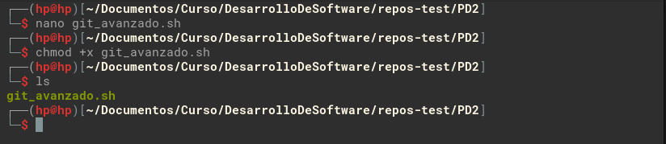

Creamos un repositorio en GitHub, la cual se utilizara en el desarrollo de esta PD.

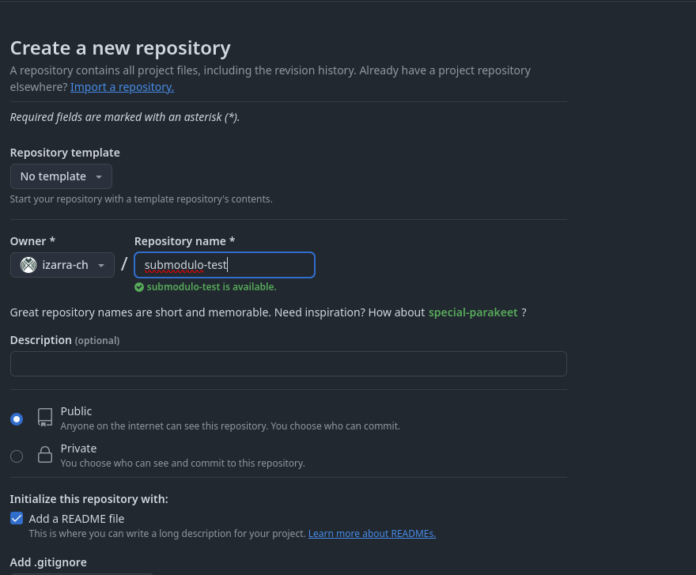

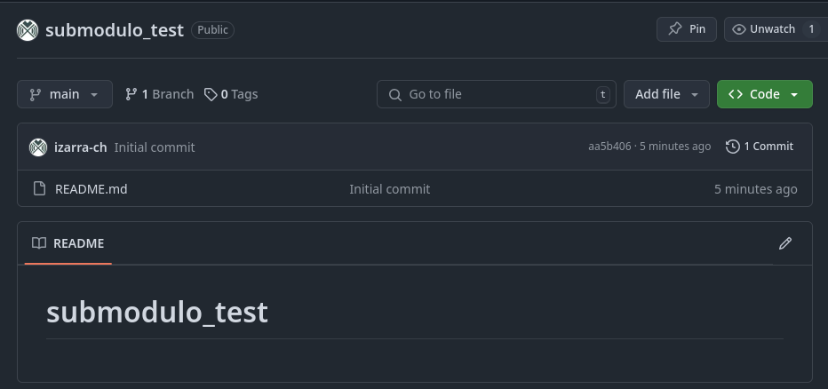

Clonamos el repositorio y movemos el archivo `git_avanzado.sh` al directorio del repositorio

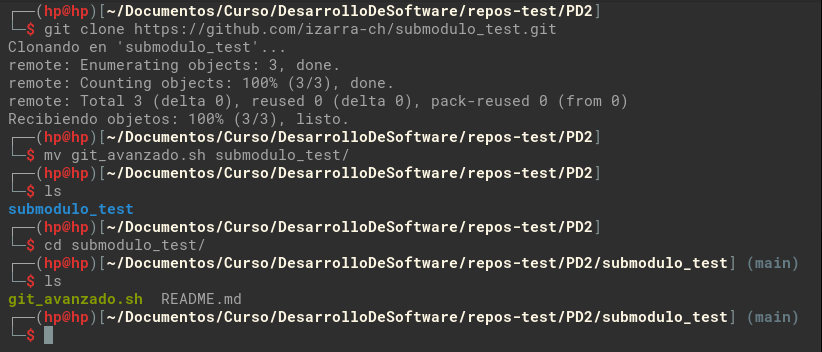

### Procedimiento de la actividad

1. Inicio del script

    Iniciamos el script con `./git_avanzado.sh`, mostramos evidencia de la ejecución.

    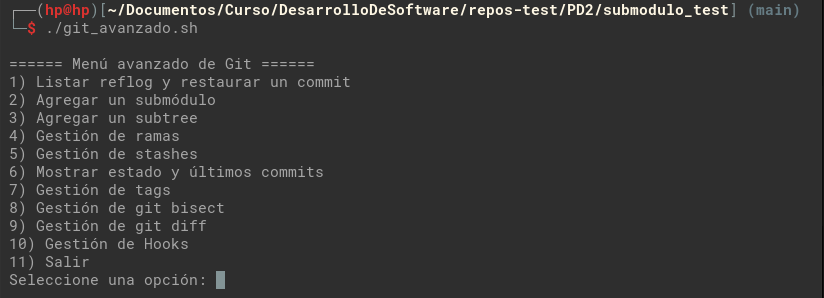

2. Opción: agregar un submódulo (Opción 2)

    Mostramos la realización del flujo que se pide.

    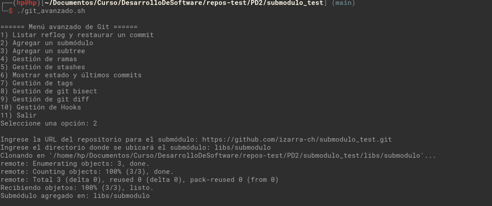

3. Opción: Gestión de ramas (Opción 4)

    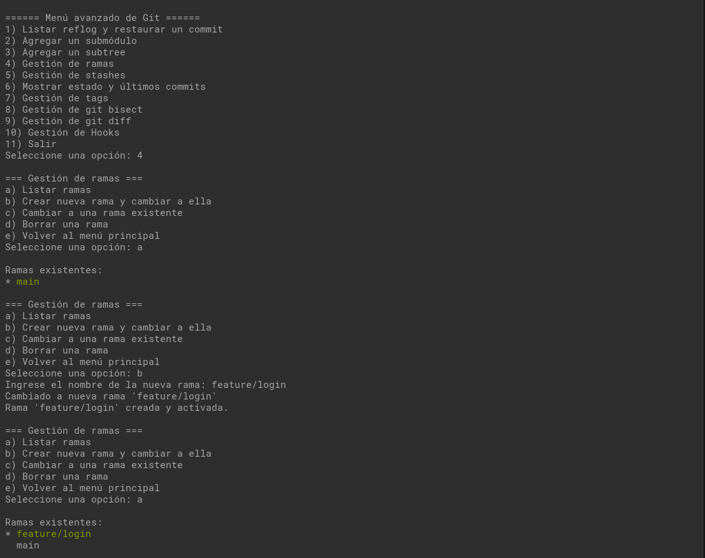

4. Opción: Gestión de git diff (Opción 9)

    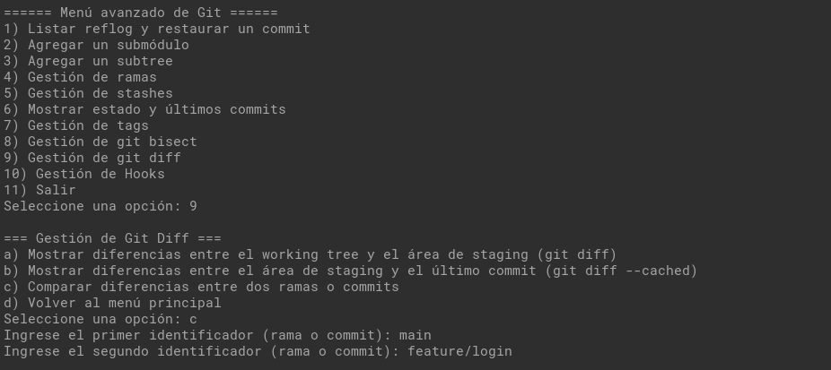

    Como no se agrego cambios en la rama `feature/login`, no vemos diferencias entre las ramas, para mostrar un ejemplo de la opción 9, agregamos algunos cambios.

    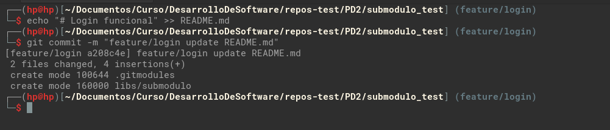

    Ahora volvemos a realizar los pasos y vemos que nos muestra las diferencias entre las dos ramas, `main` y `feature/login`

    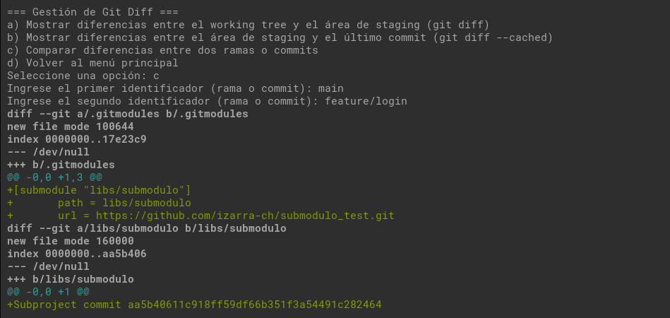

5. Opción: Gestión de hooks (Opción 10)

    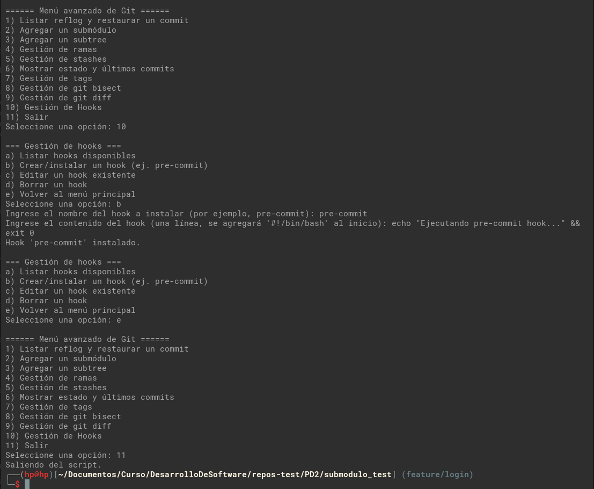

    Luego de agregar el `hook`, verificamos si se agrego correctamente, agregando un nuevo cambio y generando un nuevo commit.

    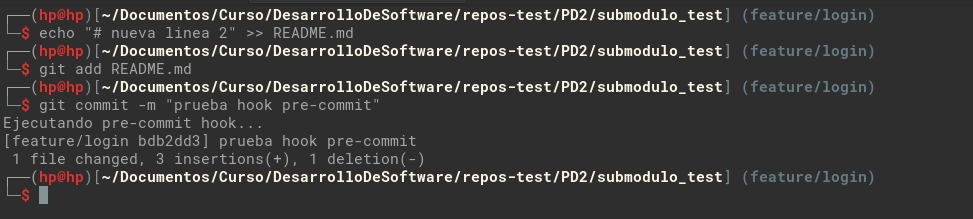

    Como se observa en la salida, antes de realizar el commit, ejecuta el hook de pre-commit agregado anteriormente, y como pasa exitosamente, continua con el registro del commit.
